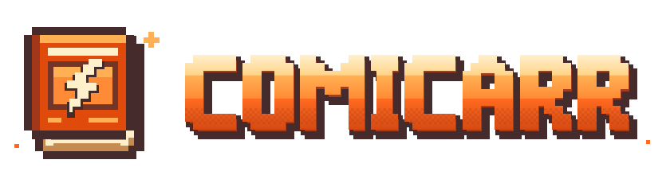

# Comicarr

<div align="center">



</div>

Comicarr is a self-hosted comic book and manga manager. Monitor series, find new
issues through your search providers, and organize downloads into your library.
Import an existing collection or migrate from Mylar3.

[Quick start](#quick-start) · [First-run setup](#first-run-setup) · [Docs](#documentation) · [Help](#contributing-and-support) · [Website](https://comicarr.com)

## What it does

- **Build your collection.** Track missing issues, import files with interactive
  matching, and organize weekly releases and story arcs. Keep comic and manga
  libraries in separate folders.
- **Find releases.** Automate searches or review candidates and match reasons
  before grabbing. Multi-issue and multi-volume packs can cover several missing
  entries with one download.
- **Follow each download.** Watch searches and grabs in the activity feed. Use
  Needs Attention to investigate failed downloads and files that never reached
  the library.
- **Connect your tools.** Serve an optional OPDS catalog to compatible readers,
  use the REST API, or configure optional AI assistance with your own endpoint
  and credentials.

Comicarr builds on [Mylar3](https://github.com/mylar3/mylar3), with a React
frontend, light and dark themes, and a FastAPI backend.

| Integration | Supported tools |
| --- | --- |
| Comic metadata and search | ComicVine; Metron search with ComicVine mappings for imports |
| Manga | MyAnimeList metadata; MangaDex metadata and chapter downloads |
| Indexers | Newznab (Usenet), Torznab (torrents) |
| Usenet clients | SABnzbd, NZBGet |
| Torrent clients | qBittorrent, Deluge, Transmission, rTorrent, uTorrent |
| Direct downloads | Mega, MediaFire, Pixeldrain |

## Quick start

Docker Compose is the recommended installation method. Images support `amd64`
and `arm64`. Create a `docker-compose.yml` file:

```yaml
services:
  comicarr:
    image: ghcr.io/frankieramirez/comicarr:latest
    container_name: comicarr
    ports:
      - "8090:8090"
    volumes:
      - ./config:/config
      - /path/to/comics:/comics
      - /path/to/manga:/manga
      - /path/to/downloads:/downloads
    environment:
      - PUID=1000
      - PGID=1000
      - TZ=Etc/UTC
    restart: unless-stopped
    stop_grace_period: 30s
```

Replace the host paths with your folders. Set `PUID` and `PGID` to the user and
group that can write to them, and choose your timezone. The
[repository compose file](docker-compose.yml) includes migration and logging options.

Comicarr stores its database, settings, logs, and encryption keys under
`/config/comicarr` inside the container (`./config/comicarr` with this example).
Keep that directory persistent and back it up before upgrades or migration.
Your download client and Comicarr must see the same completed files. Mount the
same host downloads folder in both containers at `/downloads` and configure the
client's completed-download directory accordingly.

Start Comicarr:

```bash
docker compose up -d
```

Open `http://localhost:8090`, or `http://<server-address>:8090` for a remote server.
For source installs, follow the [local setup guide](CONTRIBUTING.md#development-setup).
Install Python dependencies with `uv sync` (recommended) or `pip install .`.

## First-run setup

1. Read the setup token from the container logs:

   ```bash
   docker compose logs comicarr
   ```

   Find `[SETUP] Setup token: ...` and enter it when the setup form asks.
   Create your admin account with a password of at least eight characters.
   Comicarr restarts after saving the account.
2. Configure metadata in **Settings → API & providers**. Comic libraries need a
   [ComicVine API key](https://comicvine.gamespot.com/api/), including when using
   Metron search. Manga-only libraries can use MangaDex or MyAnimeList;
   MyAnimeList requires a client ID.
3. Set your library paths and configure a search/download route. Some clients
   require `config.ini`; follow the
   [initial setup guide](https://comicarr.com/docs/initial-setup).
   **Settings → Acquisition** shows which routes work and what is missing.

To migrate from Mylar3, back up the old installation, mount its entire config
directory read-only at `/mylar3`, and use the onboarding wizard. See the
[migration guide](https://comicarr.com/docs/migration) before starting.

### Images and updates

Use `ghcr.io/frankieramirez/comicarr` as the canonical image;
`comicarr/comicarr` on Docker Hub is a mirror. To pin a release, use the version
from [GitHub Releases](https://github.com/frankieramirez/comicarr/releases) as the
image tag, omitting the leading `v`.

After backing up, update the image with `docker compose pull`, then recreate the
container with `docker compose up -d`. A pull alone leaves the running container
unchanged. See [updating](https://comicarr.com/docs/deployment/updating) for details.

## Documentation

| Guide | Use it for |
| --- | --- |
| [Installation](https://comicarr.com/docs/installation) | Docker paths, permissions, and platform notes |
| [Configuration](https://comicarr.com/docs/configuration) | Providers, download clients, and settings |
| [Operator guide](docs/operator-guide.md) | Release review, packs, comic/manga classification, and logging |
| [Download recovery](docs/operations/acquisition-recovery.md) | Investigating acquisitions that need attention |
| [API reference](https://comicarr.com/docs/api) | REST endpoints, authentication, and live events |

Browse the [full documentation](https://comicarr.com/docs) for library, manga,
reading, and deployment guides.

## Contributing and support

For setup problems, start with [troubleshooting](https://comicarr.com/docs/troubleshooting).
[Report a bug](https://github.com/frankieramirez/comicarr/issues/new?template=bug_report.md)
with your version and installation method. You can create a Support bundle in
**Settings → About**; review its files before attaching it publicly.
[Feature requests](https://github.com/frankieramirez/comicarr/issues/new?template=feature_request.md)
have their own template.

See [CONTRIBUTING.md](CONTRIBUTING.md) for development setup and checks, and the
[Code of Conduct](CODE_OF_CONDUCT.md) for community guidelines. Report
vulnerabilities privately using the [security policy](SECURITY.md).

## Attribution and license

Comicarr builds on the Mylar3 team's work on comic management, downloading, and
post-processing. It is licensed under the
[GNU General Public License v3.0](LICENSE), like Mylar3.
